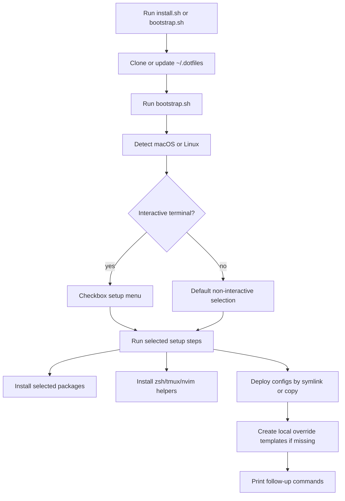
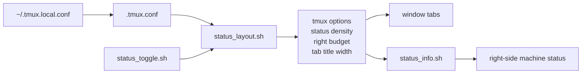

# Dotfiles

> My personal dotfiles for zsh, tmux, nvim, and more. One-command setup across macOS and Linux via `stow` symlinks or copied files.

## Quick Install

```bash
# Clone and bootstrap
git clone https://github.com/gausshj/dotfiles.git ~/.dotfiles
cd ~/.dotfiles
./bootstrap.sh

# Or one-liner for the public repo
curl -fsSL https://raw.githubusercontent.com/gausshj/dotfiles/main/install.sh | bash
```

## Install Flow



## What's Included

| Package | Description |
|---------|-------------|
| `zsh/` | `.zshrc`, `.p10k.zsh` — OMZ + powerlevel10k + plugins |
| `tmux/` | `.tmux.conf`, status bar, popup shell/scratch, fzf pane switcher |
| `nvim/` | `.config/nvim/init.vim` — gruvbox, LSP, treesitter, telescope |
| `git/` | shared `.gitconfig`; identity/signing live in `~/.gitconfig.local` |
| `packages/` | package manifests used by `bootstrap.sh` |
| `Brewfile` | macOS-only: manual `brew bundle` alternative |
| `scripts/` | optional local setup and manual test helpers |

## Structure

```
.
├── bootstrap.sh          # Main installer (run locally)
├── uninstall.sh          # Interactive uninstaller
├── install.sh           # One-liner entry point for curl
├── Brewfile             # macOS Homebrew packages
├── packages/            # Package manifests used by bootstrap.sh
├── scripts/
│   ├── configure-git.sh      # Optional personal Git/GPG/GitHub setup
│   └── manual-test-docker.sh # Human install test container
├── zsh/
│   ├── .zshrc           # Main zsh config
│   └── .p10k.zsh        # powerlevel10k theme
├── tmux/
│   ├── .tmux.conf       # Main tmux config (macOS + Linux unified)
│   └── .config/tmux/scripts/
│       ├── pane_switcher.sh
│       ├── popup.sh
│       ├── status_layout.sh
│       ├── status_toggle.sh
│       └── status_info.sh
├── nvim/.config/nvim/
│   └── init.vim         # Neovim/Vim init (Linux primary)
├── git/
│   └── .gitconfig
└── templates/           # Machine-specific overrides (gitignored)
    ├── zshrc.secrets
    ├── zshrc.local
    └── gitconfig.local
```

## Setup on a New Machine

```bash
# 1. Clone this repo
git clone https://github.com/gausshj/dotfiles.git ~/.dotfiles

# 2. Bootstrap
cd ~/.dotfiles
./bootstrap.sh

# 3. Restart terminal
exec zsh
```

## Interactive Installer

`bootstrap.sh` shows a checkbox-style setup menu when run in an interactive
terminal. A typical Linux run looks like this:

```text
◆  Dotfiles setup
│
│  ↑/↓ or j/k move · Space toggle · Enter run
│  a all · n none · q cancel
│
│  › ●  Install system packages
│    ●  Install oh-my-zsh, powerlevel10k, zsh plugins
│    ●  Install tmux plugin manager
│    ●  Use symlinks via stow (uncheck to copy files)
│    ●  Deploy zsh config
│    ●  Deploy tmux config
│    ●  Deploy shared git config
│    ●  Deploy nvim config
│    ●  Create local template files
│    ○  Configure personal Git/GPG/GitHub auth
│    ●  Set default shell to zsh
│    ●  Install tmux plugins
│    ●  Install nvim plugin manager and plugins
│    ○  Configure timezone
│
◇  Press Enter to continue.
```

Keys:

| Key | Action |
|-----|--------|
| `↑` / `↓` or `k` / `j` | Move the cursor |
| `Space` | Toggle the current item |
| `Enter` | Run selected items |
| `a` | Select all |
| `n` | Select none |
| `q` | Cancel |

Setup options:

| Option | Default | What it does |
|--------|---------|--------------|
| Install system packages | On | Installs packages from `packages/` with apt or Homebrew |
| Install oh-my-zsh, powerlevel10k, zsh plugins | On | Installs the zsh framework, theme, and shared plugins |
| Install tmux plugin manager | On | Installs TPM under `~/.tmux/plugins/tpm` |
| Use symlinks via stow | On | Uses GNU Stow links; uncheck to copy files into `$HOME` |
| Deploy zsh config | On | Deploys `.zshrc` and `.p10k.zsh` |
| Deploy tmux config | On | Deploys `.tmux.conf` and tmux helper scripts |
| Deploy shared git config | On | Deploys shared git behavior, not personal identity |
| Deploy nvim config | Linux on, macOS off | Deploys `nvim/.config/nvim/init.vim` |
| Create local template files | On | Creates local override files only when missing |
| Configure personal Git/GPG/GitHub auth | Off | Prompts for identity/signing/auth and writes local-only config |
| Set default shell to zsh | On | Runs `chsh`; if it fails, the final message prints manual commands |
| Install tmux plugins | On | Runs TPM plugin installation when tmux is available |
| Install nvim plugin manager and plugins | Follows nvim deploy | Installs vim-plug and syncs pinned plugins |
| Configure timezone | Off | Optional timezone picker; first option keeps the current timezone |

By default, configs are deployed with `stow` symlinks. Uncheck `Use symlinks via stow` to copy files into `$HOME` instead. If an existing dotfile would conflict, `bootstrap.sh` backs it up under `~/.dotfiles-backup/<timestamp>/` before deploying the repo version.

System packages are listed in plain text under `packages/`:

| File | Used for |
|------|----------|
| `packages/linux-apt.txt` | Ubuntu/Debian apt packages |
| `packages/macos-taps.txt` | Homebrew taps |
| `packages/macos-brews.txt` | Homebrew formulae |
| `packages/macos-casks.txt` | Homebrew casks |

The checked-in `zsh/.p10k.zsh` file is deployed as the default prompt configuration.

On a personal development machine, optionally configure Git identity, commit signing, and `GH_TOKEN`:

```bash
cd ~/.dotfiles
./scripts/configure-git.sh
```

Or include it during bootstrap:

```bash
DOTFILES_CONFIGURE_GIT=1 ./bootstrap.sh
```

For non-interactive installs, the default selection is used:

```bash
DOTFILES_NO_PROMPT=1 ./bootstrap.sh
```

Non-interactive defaults can be overridden with `DOTFILES_*` flags, for example:

```bash
DOTFILES_NO_PROMPT=1 DOTFILES_USE_SYMLINKS=0 DOTFILES_CHANGE_SHELL=0 ./bootstrap.sh
```

Timezone configuration is optional and off by default. If selected in the interactive menu, the first choice keeps the current system timezone. Common choices are grouped behind readable labels:

- `China - Beijing Time (Asia/Shanghai)` is available as a direct common choice.
- `United States` timezones are shown as Eastern, Central, Mountain, and Pacific.
- `Browse/search all timezones...` supports searching, browsing by region, or manually entering an IANA timezone.

For non-interactive timezone setup:

```bash
DOTFILES_NO_PROMPT=1 DOTFILES_CONFIGURE_TIMEZONE=1 DOTFILES_TIMEZONE=Asia/Shanghai ./bootstrap.sh
```

`install.sh` also accepts a branch for testing PRs before merge:

```bash
DOTFILES_BRANCH=your-branch-name \
  curl -fsSL https://github.com/gausshj/dotfiles/raw/your-branch-name/install.sh | bash
```

## Re-running the Installer

The installer is designed to be re-run.

- Existing package managers handle already-installed packages: Homebrew entries are checked with `brew list`, and apt receives the full package list through `apt install -y`, which keeps installed packages instead of duplicating them.
- Existing framework/plugin directories are reused: oh-my-zsh, powerlevel10k, zsh plugins, TPM, and vim-plug are skipped when their directories or files already exist.
- Existing dotfile links are refreshed with `stow -R`; copied-file mode overwrites the selected copied files from the repository.
- Local template files such as `~/.zshrc.local`, `~/.zshrc.secrets`, and `~/.gitconfig.local` are created only if missing.
- The one-line `curl` install clones into `~/.dotfiles` on the first run. Later runs pull the latest checkout with `git pull --rebase --autostash`, then run `bootstrap.sh` again.

On an existing machine, re-running the curl command updates selected managed configs such as tmux when they are enabled in the setup menu. Disable a deploy option in the menu if you do not want that config refreshed on that run.

## Local Overrides

Shared configs stay in the repository. Machine-specific settings stay outside
git in local override files:

| File | Purpose |
|------|---------|
| `~/.zshrc.local` | Local shell aliases, paths, and machine-only tweaks |
| `~/.zshrc.secrets` | Secrets exported into the shell environment |
| `~/.gitconfig.local` | Git identity, email, signing key, and credential helpers |
| `~/.tmux.local.conf` | Machine-specific tmux UI choices |

The installer creates template files only when they are missing, so re-running
the installer does not overwrite local secrets or local UI preferences.

## macOS Only

```bash
brew bundle --file=~/.dotfiles/Brewfile
```

When using iTerm2's own status widgets, keep tmux's window list while hiding the
right-side machine status with `~/.tmux.local.conf`:

```tmux
set -g @tmux_status_preference "off"
set -g status-right ""
set -g status-right-length 0
```

The shared tmux config loads `~/.tmux.local.conf` last, so local UI choices do
not need to fork the repo config. A ready-to-copy macOS example lives at
`templates/tmux.local.macos`.

Toggle the right-side machine status for the current tmux session:

```bash
~/.config/tmux/scripts/status_toggle.sh toggle
~/.config/tmux/scripts/status_toggle.sh on
~/.config/tmux/scripts/status_toggle.sh off
```

Equivalent tmux key: `prefix + i`.

## tmux Status Layout

The tmux status bar keeps the window list as the primary UI and treats machine
status as optional. A small layout helper calculates the shared width budget so
the tab list and right-side status do not independently guess how much space is
available.



Density levels:

| Density | Typical output | When used |
|---------|----------------|-----------|
| `full` | CPU, memory, GPU, network, disk, date/time, host when they fit | Few windows and wide terminal |
| `medium` | Disk when it fits, date/time, host | Moderate space |
| `compact` | Time and host | Many windows or tighter width |
| `off` | Nothing on the right | Very narrow or user disabled |

Useful commands:

```bash
# Inspect the current layout decision.
~/.config/tmux/scripts/status_layout.sh print

# Toggle the right-side machine status.
~/.config/tmux/scripts/status_toggle.sh toggle
```

## tmux Popups

The tmux config uses native `display-popup` on tmux 3.2 or newer:

| Key | Action |
|-----|--------|
| `prefix + g` | Temporary shell popup in the current pane directory |
| `prefix + G` | Persistent scratch popup backed by the `tmux-scratch` session |
| `prefix + i` | Toggle the right-side machine status segment |

Popups attach to a tmux session inside the popup, so normal tmux copy-mode works
there too. Use `prefix + [` inside the popup, select with vi-style keys, and copy
with `y`. Copy-mode sends the selection to tmux's paste buffer and, when a
clipboard command is available, to the system clipboard (`pbcopy` on macOS,
`wl-copy`/`xclip`/`xsel` on Linux).

The right-side machine status is split into CPU, memory, GPU when available,
network when available, disk usage for local mounts, time, and a short host
label. `status_layout.sh` owns the shared width budget for tabs and machine
status, while `status_info.sh` only prints the status segments allowed by the
current density (`full`, `medium`, `compact`, or `off`). When many windows are
open or the terminal is narrow, tmux prioritizes the window list and reduces or
hides the machine status first.

Window tabs split the available client width across windows, then clamp each
title to a readable min/max width. Short names pad evenly; long names shrink
with an ellipsis. The active tab uses a rounded highlight, while inactive tabs
stay lightweight.

Override popup defaults locally:

```tmux
set-environment -g TMUX_POPUP_WIDTH 90%
set-environment -g TMUX_POPUP_HEIGHT 85%
set-environment -g TMUX_POPUP_SCRATCH_SESSION my-scratch
```

## Linux Only (nvim)

```bash
stow -t ~ nvim
```

`bootstrap.sh` installs `vim-plug` for Neovim, installs/updates pinned plugins, and removes plugins that are no longer listed when the nvim config is selected. To retry plugin installation manually:

```bash
nvim '+PlugInstall --sync' '+PlugUpdate --sync' '+PlugClean!' +qall
```

Disable this step during automated runs with:

```bash
DOTFILES_INSTALL_NVIM_PLUGINS=0 ./bootstrap.sh
```

## Manual Install Test

For a human pass through the interactive installer:

```bash
scripts/manual-test-docker.sh --branch your-branch-name
```

The container prints login details and test commands on startup. Inside it, run `test-local` to test the mounted working tree or `test-curl` to test the pushed branch. See `docs/manual-test.md` for proxy usage and post-install checks.

## Updating

```bash
cd ~/.dotfiles && git pull && ./bootstrap.sh
```

## Cross-Platform Design

- `.tmux.conf` uses `if-shell` to detect Darwin vs Linux for shell/path differences
- `.zshrc` respects Homebrew only on macOS (`if command -v brew`)
- Machine-specific values go in `~/.zshrc.secrets`, `~/.zshrc.local`, and `~/.gitconfig.local`
- `stow` creates symlinks so changes in `~/.dotfiles` are reflected everywhere; copied-file mode is available for machines where symlinks are not desired

## Privacy Model

This repository is intended to be public. Do not commit real identities, API keys, database credentials, proxy credentials, private machine paths, SSH keys, or GPG private material.

The shared `git/.gitconfig` includes only common behavior. `scripts/configure-git.sh` prompts for `user.name`, `user.email`, optional GPG signing, and optional `GH_TOKEN`, then writes them to local-only files under `$HOME`.

## Manual TPM (tmux plugin) Installation

If tmux is already running:

```
Ctrl-b + I   # install plugins (prefix+I)
```

## Uninstall

```bash
cd ~/.dotfiles
./uninstall.sh
```

The uninstaller also uses the same Up/Down, Space, Enter checkbox menu. By default it removes deployed config links and copied files that still exactly match the repo version. Removing local template files, tmux plugins, oh-my-zsh, or changing the default shell back to bash must be explicitly selected.
